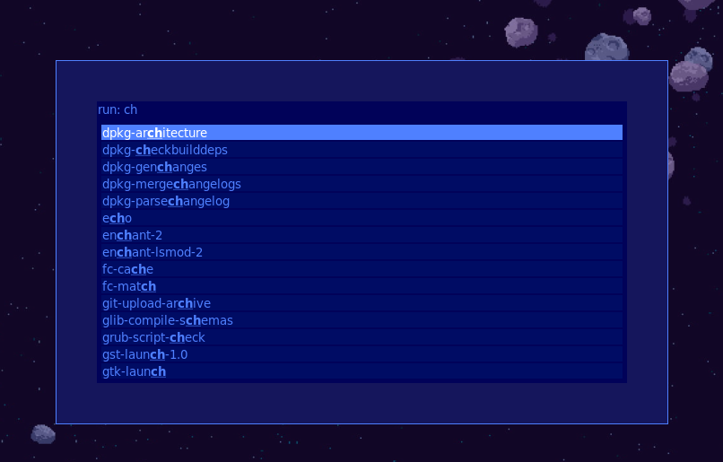

# Dotfiles

 

## Dependencies

* [Rofi](https://github.com/davatorium/rofi);
* [Ubuntu Yaru theme suite](https://github.com/ubuntu/yaru)
* [Oh my Posh](https://github.com/jandedobbeleer/oh-my-posh);
* [Microsoft terminal](https://github.com/microsoft/terminal);
* [Bracket Pair Colorizer 2](https://github.com/CoenraadS/Bracket-Pair-Colorizer-2);
* [Omni Theme](https://marketplace.visualstudio.com/items?itemName=rocketseat.theme-omni);
* [Material Icon Theme](https://marketplace.visualstudio.com/items?itemName=PKief.material-icon-theme);

### Fonts &#127374;

* [JetBrains Mono](https://github.com/JetBrains/JetBrainsMono);
* [Meslo LGM NF](https://github.com/ryanoasis/nerd-fonts/releases/);
